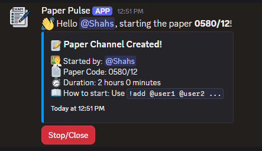
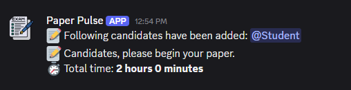
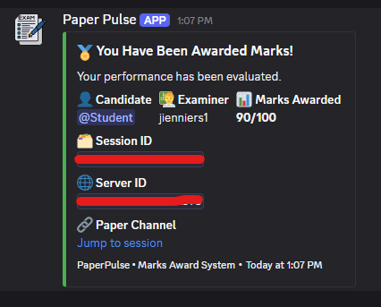
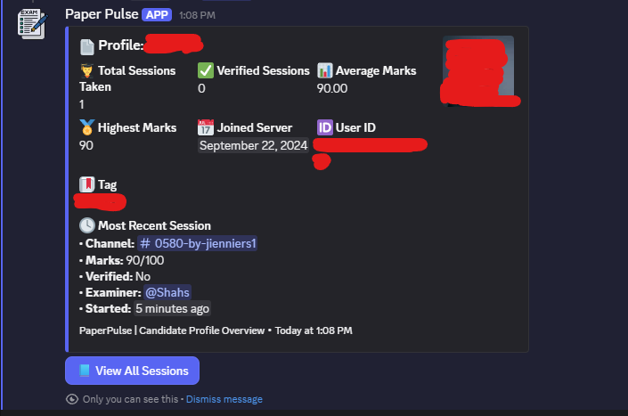

# 📄 PaperPulseBot

A **Discord bot** for running timed paper sessions inside a server. Built with **Node.js**, **discord.js**, and **MongoDB**, PaperPulseBot creates paper channels, assigns examiners, tracks candidates, forwards PDF submissions, records marks and verification status, and keeps session data persistent.

---

## 🔗 Invite Bot

[Invite PaperPulseBot to your Discord server](https://discord.com/oauth2/authorize?client_id=1509162813015195699&permissions=19472&integration_type=0&scope=bot+applications.commands)

---

## ✨ Features

- Configure a Discord category for paper session channels.
- Start a paper session with a paper code, duration, and examiner.
- Create a dedicated text channel for each paper session.
- Add one or more candidates and start the paper timer.
- Send time warnings near the end of the session.
- Accept PDF uploads and forward them to the assigned examiner by DM.
- Let examiners verify candidates and award marks.
- Generate candidate profiles from stored session history.
- Show a channel-specific leaderboard.
- Persist server, session, candidate, mark, and verification data in MongoDB.

---

## 🔧 Tech Stack

- **Language:** JavaScript (Node.js)
- **Discord Library:** [discord.js v14](https://discord.js.org/)
- **Database:** MongoDB
- **ODM:** Mongoose
- **Environment Config:** dotenv
- **Code Quality:** ESLint
- **Code Style:** Prettier
- **Containerization:** Docker / Docker Compose

---

## 📘 Commands Overview

### Slash Commands

| Command        | Description                                                                                                    | Usage                                                  |
| -------------- | -------------------------------------------------------------------------------------------------------------- | ------------------------------------------------------ |
| `/set`         | Configure PaperPulse settings. Currently supports the paper category ID.                                       | `/set setting:Paper Category value:<category-id>`      |
| `/startpaper`  | Create a new paper session channel and assign an examiner.                                                     | `/startpaper paper:0580/12 time:60 examiner:@examiner` |
| `/upload`      | Upload a solved paper PDF for the assigned examiner. The file is forwarded by DM and is not stored in MongoDB. | `/upload file:<paper.pdf>`                             |
| `/verify`      | Mark a candidate as verified for the current session. Examiner only.                                           | `/verify user:@candidate`                              |
| `/award`       | Award marks to a candidate in `score/total` format. Examiner only.                                             | `/award user:@candidate marks:70/100`                  |
| `/profile`     | View a candidate profile. Defaults to the command user when no user is provided.                               | `/profile` or `/profile user:@candidate`               |
| `/leaderboard` | Show the leaderboard for the current session channel.                                                          | `/leaderboard`                                         |

---

### Message Commands

| Command          | Description                                                      | Usage                |
| ---------------- | ---------------------------------------------------------------- | -------------------- |
| `!add @users...` | Add candidates to the current paper session and start the timer. | `!add @user1 @user2` |

> ⚠️ `!add` **must** be used inside a paper session channel. Bot users and the assigned examiner are skipped.

---

## 🧭 Typical Session Flow

1. An administrator configures the paper category:

    ```bash
    /set setting:Paper Category value:<category-id>
    ```

2. A user starts a paper session:

    ```bash
    /startpaper paper:0580/12 time:60 examiner:@examiner
    ```

3. The bot creates a paper channel under the configured category.
4. The examiner or session operator adds candidates in that channel:

    ```bash
    !add @candidate1 @candidate2
    ```

5. Candidates upload solved papers as PDFs:

    ```bash
    /upload file:<paper.pdf>
    ```

6. The examiner verifies candidates and awards marks:

    ```bash
    /verify user:@candidate
    /award user:@candidate marks:70/100
    ```

7. Users can view profiles and leaderboards:

    ```bash
    /profile user:@candidate
    /leaderboard
    ```

---

## 🖼️ Screenshots

### Paper Session Channel Embed



### Paper Started Message



### Marks Awarded DM



### Candidate Profile



---

## 🚀 Getting Started

### Prerequisites

- **Node.js**
- **npm**
- **MongoDB**, either local or Docker-hosted
- **Discord Application + Bot Token**

### Environment Variables

Create a `.env` file in the project root. You can start from the example file:

```bash
cp examples/.env .env
```

Required for normal bot startup:

```env
TOKEN=your_discord_bot_token
MONGO_URL=mongodb://localhost:27017/botData
```

Required only for the optional slash-command management scripts:

```env
CLIENT_ID=your_application_client_id
GUILD_ID=your_test_guild_id
```

Use this MongoDB URL when running the bot and MongoDB together through Docker Compose:

```env
MONGO_URL=mongodb://mongo:27017/botData
```

> ⚠️ Do not commit `.env`. Keep your bot token private.

---

## 💻 Running Locally

1. Install dependencies:

    ```bash
    npm install
    ```

2. Start MongoDB. One Docker option is:

    ```bash
    docker run -d --name paperpulse-mongo -p 27017:27017 -v mongo-data:/data/db mongo:8.2
    ```

3. Start the bot:

    ```bash
    node index.js
    ```

The bot registers global slash commands on startup.

---

## 🛠️ Slash Command Scripts

The bot registers global slash commands when it starts. These scripts are optional helpers for manual command management.

Register guild slash commands:

```bash
node scripts/deploy-slash-commands.js
```

Clear global and guild slash commands:

```bash
node scripts/clear-slash-commands.js
```

These scripts require `TOKEN`, `CLIENT_ID`, and `GUILD_ID` in `.env`.

---

## 🐳 Docker

The repository includes a `Dockerfile` and `docker-compose.yml` for running the bot with MongoDB.

```bash
docker compose up -d --build
```

MongoDB data is stored in the `mongo-data` Docker volume. To stop the containers:

```bash
docker compose down
```

To remove the MongoDB volume as well:

```bash
docker compose down -v
```

---

## 🗄️ Data Storage

PaperPulseBot keeps active state in memory and periodically persists it to MongoDB.

MongoDB stores a single `BotState` document with a `state.guilds` object. The persisted structure is organized by guild ID, then by session channel ID:

```js
{
  guilds: {
    [guildId]: {
      categoryId,
      sessions: {
        [channelId]: {
          examinerId,
          paperTimeMins,
          status,
          candidates: {
            [userId]: {
              userId,
              verified,
              marks,
              addedAt
            }
          }
        }
      }
    }
  }
}
```

The bot saves state to MongoDB every 3 seconds and loads it again on startup.

---

## 🔒 Privacy

The bot stores only the data needed to operate paper sessions and candidate history, such as Discord IDs, configured category IDs, session channel IDs, marks, verification status, and candidate added timestamps.

Uploaded PDFs are forwarded to the assigned examiner by Discord DM and are not stored in MongoDB by the bot.

See [docs/privacy-policy.md](docs/privacy-policy.md) for the full privacy policy.

---

## 📋 Code Quality

Run ESLint:

```bash
npm run lint
```

Fix lint issues:

```bash
npm run lintfix
```

Format with Prettier:

```bash
npm run format
```

Check formatting:

```bash
npm run format:check
```

---

## 🏗️ Project Structure

```text
commands/
  messageCommands/      Message command handlers such as !add
  slashCommands/        Slash command handlers
data/                   Shared runtime state
database/models/        Mongoose models
docs/                   Project documentation and policies
scripts/                Optional slash command management scripts
utils/                  Discord, database, and shared helpers
```

---

## 🤝 Contributing

Contributions, suggestions, and improvements are welcome!

If you'd like to contribute to **PaperPulseBot**, follow these steps:

### 📦 Fork & Clone

1. Fork the repository
2. Clone your fork:

    ```bash
    git clone https://github.com/[USERNAME]/paperpulsebot.git
    cd paperpulsebot
    ```

### 🌱 Create a Branch

Create a new feature or fix branch:

```bash
git checkout -b feature/your-feature-name
```

### ✍️ Make Changes

- Add your code or fix bugs
- Follow existing coding style
- Run linter and formatter:

    ```bash
    npm run format
    npm run lintfix
    ```

### ✅ Commit

Use [conventional commit](https://www.conventionalcommits.org/) style:

```bash
git commit -m "feat: add new exam timer logic"
```

### 🚀 Push & PR

Push your changes:

```bash
git push origin feature/your-feature-name
```

Then open a Pull Request on GitHub. Make sure to:

- Describe your changes clearly
- Reference any related issues if applicable

### 📋 Code Review

Your PR will be reviewed and tested. Make necessary changes if requested. Once approved, it will be merged into `main`.

> Thanks for helping improve **PaperPulseBot**! Your contributions make the project better for everyone. 💙

---

## 👤 Author

Built and maintained by [@Jienniers](https://github.com/Jienniers)

---

Stay tuned for updates and releases of **PaperPulseBot**!

Feel free to ⭐ the repository if you find it useful!
